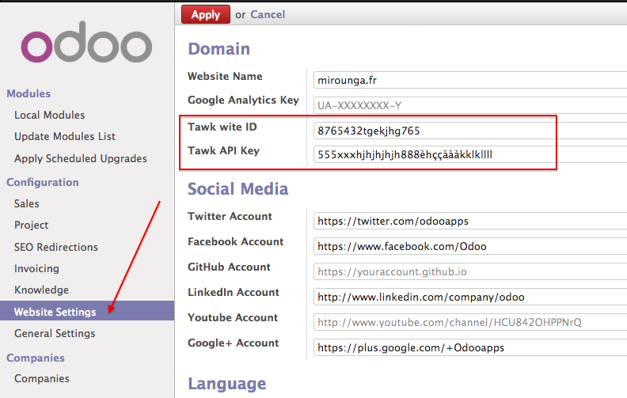

.. image:: https://img.shields.io/badge/licence-AGPL--3-blue.svg
   :target: http://www.gnu.org/licenses/agpl-3.0-standalone.html
   :alt: License: AGPL-3

================
website_mga_tawk
================

This module integrate the livechat module base on Tawk.to and integrate it to the website module

Installation
============

To install this module, you need to:

#. Add this repository
#. Install the website_mga_tawk

Configuration
=============

To configure this module, you need to:

#. Go to Settings -> Configuration -> Website Settings
#. Add the Site ID Key and the API Key and save
#. Refresh your browser and go to the website

Known issues / Roadmap
======================

Nothing Yet

Bug Tracker
===========

Bugs are tracked on `GitHub Issues
<https://github.com/mga-team-odoo/website/issues>`_. In case of trouble, please
check there if your issue has already been reported. If you spotted it first,
help us smash it by providing detailed and welcomed feedback.

Credits
=======

Contributors
------------

* Christophe CHAUVET <christophe.chauvet@gmail.com>

